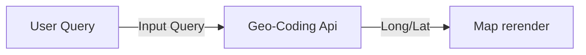

# PwC Software Engineering Intern Assignment 

A web application that allows users to **search** a specified city on a map.

# Technologies used

 - HTML5
 - CSS3
 - JavaScript

## API
- [Mapbox](https://docs.mapbox.com/mapbox-gl-js)
- [Ninja Geocoding API](https://api-ninjas.com/api/geocoding)
